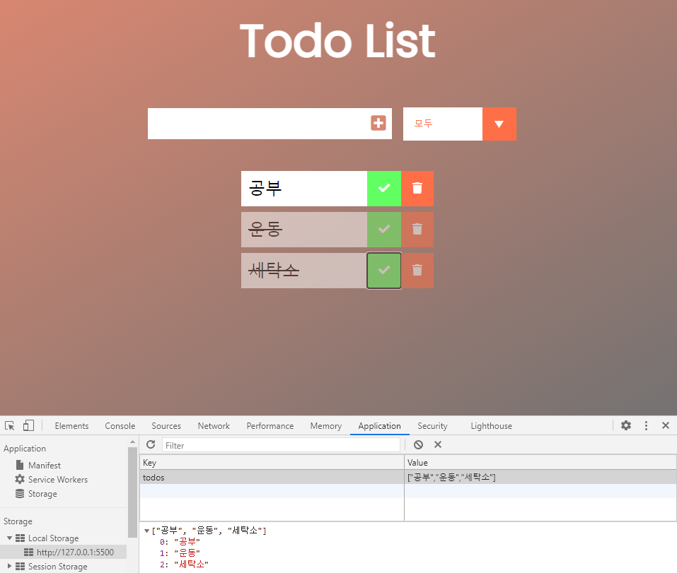
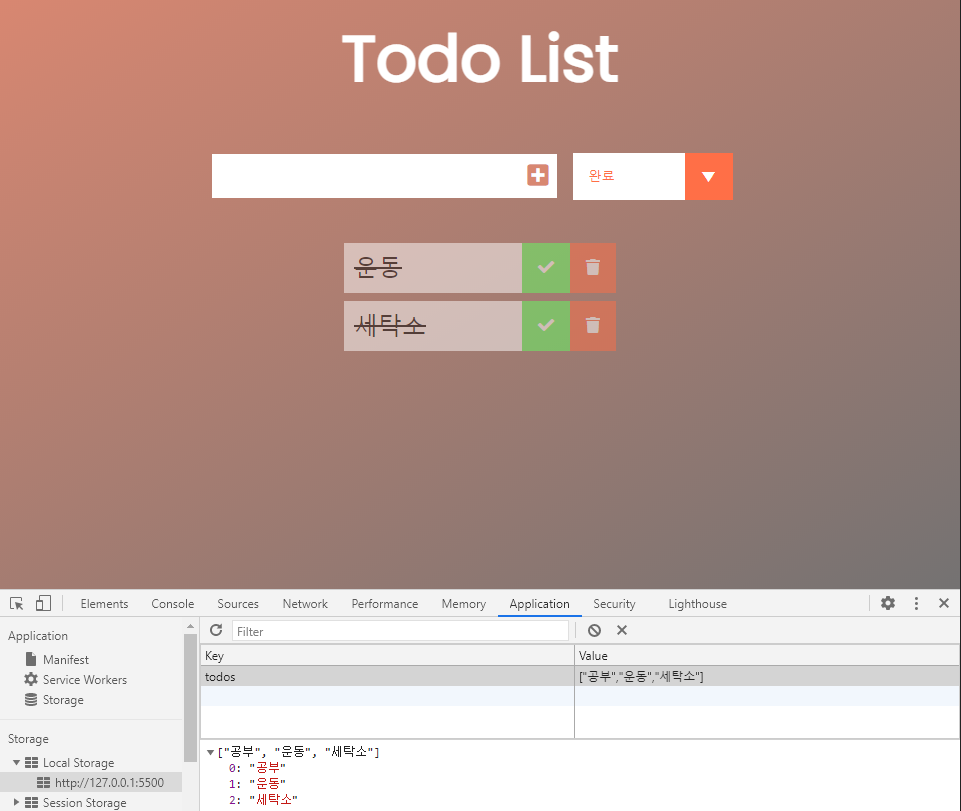

# Todo List

- 해야 할 일들을 입력, 삭제 기능 구현
- 로컬 스토리지와 연결함으로써 새로 고침 시에도 남아있음

## 주요 기능

### 1. todo 추가하기

- 할 일을 입력 후 '+' 버튼을 눌러 list에 추가

### 2. todo 삭제하기

- 삭제 버튼을 눌러 할 일을 list에서 삭제

### 3. todo 확인하기

- 체크 버튼을 눌러 할 일을 완료

### 4. todo 필터링하기

- `all`, `completed`, `uncompleted` 에 따라 필터링 가능

### 5. 로컬 스토리지 구현

- 로컬 스토리지에 저장이 가능하여 새로고침 및 다시 접속해도 정보가 남아있음

## 구동 화면




## 소스코드

- '+' 버튼 클릭 시 아래에 todo list 를 추가한다.

```js
    // class이름이 todo인 div를 만든다
    const todoDiv = document.createElement('div');
    todoDiv.classList.add('todo');

    // li 를 만들면서 텍스트 삽입
    const newTodo = document.createElement('li');
    newTodo.innerText = todoInput.value;
    newTodo.classList.add('todo-item');

    todoDiv.appendChild(newTodo);
     // 로컬 스토리지에 추가
    saveLocalTodos(todoInput.value);
    ...
    // check, delete 버튼 추가
    ...
```

- `case` 값에 따른 필터링 기능 코드

```js
const todos = todoList.childNodes;
todos.forEach(function (todo) {
  // all, completed, uncompleted
  switch (e.target.value) {
    case "모두":
      todo.style.display = "flex";
      break;
    case "완료":
      if (todo.classList.contains("완료")) {
        todo.style.display = "flex";
      } else {
        todo.style.display = "none";
      }
      break;
    case "미완료":
      if (!todo.classList.contains("완료")) {
        todo.style.display = "flex";
      } else {
        todo.style.display = "none";
      }
      break;
  }
});
```
